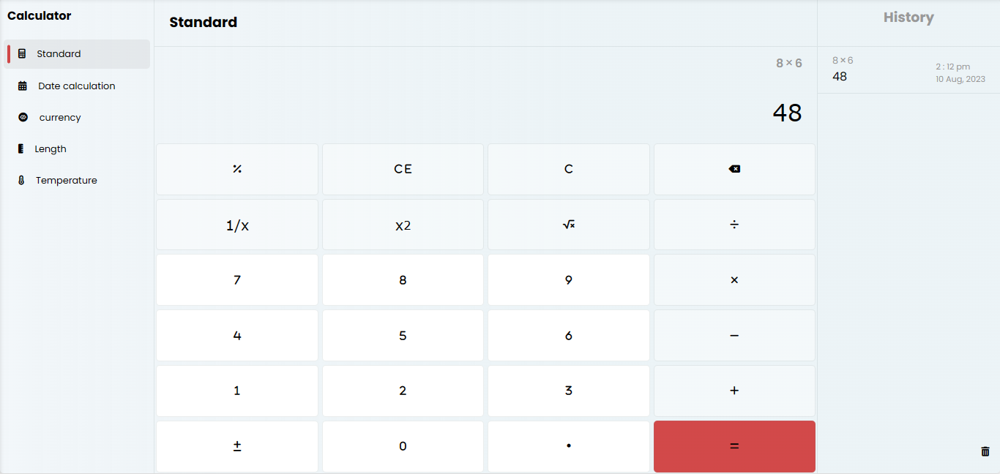

# Simple Calculator Project

Welcome to the Simple Calculator Project repository! This repository contains a collection of simple calculators developed using HTML, CSS, and vanilla JavaScript.

## Overview

This project aims to provide easy-to-use calculators for various purposes, emphasizing simplicity and functionality. Whether you need to perform basic arithmetic, calculate percentages, or handle more advanced mathematical operations, you'll find a calculator here to suit your needs.

visit app: [https://devmrvicky.github.io/calculators/](https://devmrvicky.github.io/calculators/)

## Features

- Pure HTML, CSS, and JavaScript implementation.
- User-friendly interface.
- Multiple calculators for different purposes.

## Available Calculators

- Basic Arithmetic Calculator
- Percentage Calculator (coming soon)
- Scientific Calculator (coming soon)
